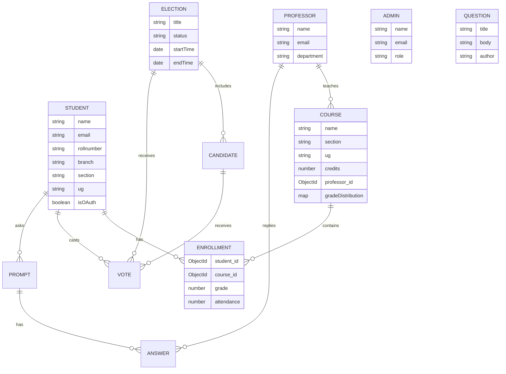

# Campus_Connect_AG System Architecture & Wireframe

## 1. System Overview
**Campus_Connect_AG** is a Full-Stack Web Application designed for university management, facilitating interaction between Students, Professors, and Administrators.

**Technology Stack:**
- **Frontend:** React.js (Vite), Redux (State Management), React Router (Navigation).
- **Backend:** Node.js, Express.js.
- **Database:** MongoDB (Mongoose ODM).
- **Authentication:** Passport.js (OAuth), JWT (implied/likely), Express Session.

---

## 2. Database Design (Schema Wireframe)
The database is structured around three primary user roles and their academic activities.



### Key Models
1.  **Student**: Stores personal details, OAuth status, and embedded `courses` array (Enrollment) tracking attendance and grades.
2.  **Course**: Academic courses with metadata (`credits`, `totalclasses`) and a reference to the `Professor`.
3.  **Professor**: Faculty members who manage courses.
4.  **Election/Candidate/Vote**: Voting system modules.
5.  **Question/Answer/Forum**: Q&A platform for academic discussions.

---

## 3. Frontend Architecture (UI Wireframe)

The frontend is a **Single Page Application (SPA)** built with React.

### Router Map (`App.jsx`)

#### Public Routes
- `/` -> **Home**: Landing page.
- `/login` -> **Login**: User authentication (Email/Pass + OAuth).
- `/register` -> **Register**: New user sign-up.
- `/pricing` -> **Pricing**: (Likely a static or info page).
- `/oauth-callback` -> **OAuthCallback**: Handle login redirect.

#### Protected Routes (Requires Auth)
- `/dashboard` -> **Dashboard**: Main landing after login. Shows relevant stats.
- `/profile` -> **ProfileWrapper**: Renders `Profile` (Student) or `ProfessorProfile` based on role.
- `/forum/questions` -> **ForumList**: List of Q&A threads.
- `/forum/ask` -> **AskQuestion**: Form to post new questions.
- `/forum/question/:id` -> **ForumDetail**: View single question and answers.

#### Student-Only Routes
- `/attendance` -> **Attendance**: View course attendance records.
- `/bellgraph` -> **Bellgraph**: Visual performance analytics (Charts).
- `/elections` -> **Elections**: Voting interface.

### UI Component Hierarchy (Conceptual)
```text
App
├── Navbar (Navigation & User Info)
├── Sidebar (Contextual Navigation - Student/Prof/Admin)
└── Page Content
    ├── Dashboard
    │   ├── StatsCards (Attendance, GPA)
    │   ├── RecentActivity
    │   └── Notifications
    ├── Profile
    │   ├── RequestEditForm
    │   └── UserDetails
    ├── Forum
    │   ├── SearchBar
    │   ├── QuestionCard
    │   └── CommentSection
    └── Election
        ├── ActiveElectionsList
        └── VotingModal
```

---

## 4. Backend Architecture (API Wireframe)

The backend is organized into RESTful routes, protected by middleware.

### Middleware Layer
- **`authMiddleware`**: Verifies user session/token before access.
- **`passport`**: Handles Google/GitHub OAuth strategies.
- **`multer`**: Handles file uploads (e.g., CSV grade sheets).

### API Endpoints
#### Authentication (`/api/auth/[role]`)
- `POST /register`: Create new account.
- `POST /login`: Authenticate and start session.
- `GET /google`, `/github`: OAuth triggers.

#### Student Features (`/api/student`)
- `GET /profile`: Get student details and courses.
- `GET /attendance`: Fetch attendance specific data.
- `POST /enroll`: (If applicable) Join courses.

#### Professor Features (`/api/professor`)
- `POST /prof/submit`: **Bulk Upload** (CSV) for grades/attendance.
- `GET /courses`: List taught courses.
- `PUT /update-course`: Modify course details.

#### Forum (`/api/forum`)
- `GET /questions`: List all questions.
- `POST /question`: Create new thread.
- `POST /answer`: Reply to thread.

#### Election (`/api/election`)
- `GET /active`: Function to get current election.
- `POST /vote`: Cast a vote (Atomic/Transactional).

---

## 5. Data Flow Examples

### 1. Student Login & Dashboard Load
1.  **User** enters credentials at `/login`.
2.  **Frontend** sends `POST /api/auth/student/login`.
3.  **Backend** verifies hash, sets Session/Cookie.
4.  **Frontend** redirects to `/dashboard`.
5.  **Dashboard** calls `GET /api/student/profile`.
6.  **Backend** queries `Student` model, populating `courses`.
7.  **Frontend** renders Attendance charts using the response data.

### 2. Professor Uploads Grades
1.  **Professor** navigates to Course Manager.
2.  **Professor** selects CSV file and clicks "Upload".
3.  **Frontend** posts `FormData` to `/prof/submit`.
4.  **Backend** (Multer) saves CSV to `uploads/`.
5.  **Backend** parses CSV, iterates rows:
    - Finds `Student` by email.
    - Updates embedded `course` grade.
    - Updates `Course` grade distribution map.
6.  **Backend** sends success response.
7.  **Frontend** shows "Grades Updated" toast.
